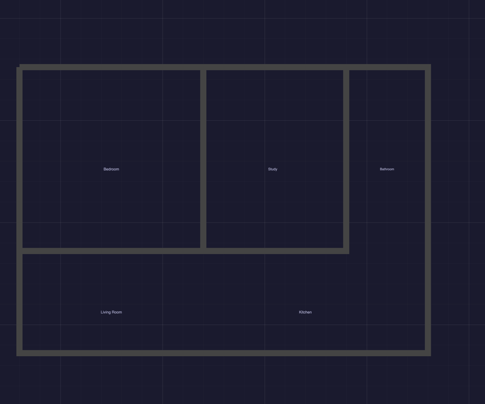

# Floor Plan Maker

A browser-based architectural floor plan editor. Draw walls with real millimeter-based measurements, drop in pre-built furniture and fixtures, create custom shapes, and export your designs to PNG, JPG, or SVG.

**[Live Demo](https://nicosandller.github.io/floor_plan_maker/)**



## Features

### Wall Drawing
- **Free-angle walls** with axis stickiness — walls snap to horizontal/vertical when close (8° threshold), but can be drawn at any angle
- **Chain drawing** — after placing a wall, continue drawing from the endpoint without re-clicking
- **Smart snapping** — walls snap to grid points and to existing wall endpoints (50mm radius)
- **Connected wall rendering** — adjacent walls share a unified perimeter with clean miter joins, while remaining individually editable
- **Real measurements** — all dimensions displayed in millimeters, with configurable wall thickness (default 150mm)
- **Editable dimension labels** — each wall shows its length (mm) on its underside; double-click a label to type a new length and the wall resizes along its original direction

### Furniture Library
30+ pre-built items across 9 categories, ready to drag and drop onto your floor plan:

| Category | Items |
|----------|-------|
| **Tables** | Dining table, Desk, Coffee table, Side table |
| **Seating** | Chair, Armchair, 2-seat sofa, 3-seat sofa |
| **Counters** | Counter segment, L-counter, Kitchen island |
| **Appliances** | Fridge, Oven/Range, Dishwasher, Washing machine, Dryer |
| **Bathroom** | Bathtub, Shower, Toilet, Single sink, Double sink |
| **Shelving & Storage** | Bookshelf, Shoe shelf, Wardrobe, Storage cabinet |
| **Doors & Windows** | Door (with swing arc), Sliding door, Double door |
| **Stairs** | Straight staircase, L-shaped staircase |
| **Beds** | Single bed, Double bed, Queen bed |

### Custom Shapes
- **Rectangles, Circles, Lines** — draw custom shapes with click-and-drag
- **Text labels** — add room names and annotations
- **Dimension annotations** — two-click measurement lines with mm readout

### Window Tool
- Click on any wall to insert a window
- Configurable window width (200–3000mm)
- Windows display with glass pane detail and frame lines

### Canvas Controls
- **Zoom** — mouse wheel to zoom in/out (centered on cursor)
- **Pan tool** — dedicated hand tool (`H`) for click-drag canvas navigation
- **Pan (alternate)** — hold Space + drag to navigate from any tool
- **Grid** — configurable grid size with snap-to-grid (toggle on/off)
- **Select & Edit** — click to select, drag to move, handles to resize/rotate

### Keyboard Shortcuts

| Key | Action |
|-----|--------|
| `V` | Select tool |
| `W` | Wall tool |
| `R` | Rectangle tool |
| `C` | Circle tool |
| `L` | Line tool |
| `T` | Text tool |
| `N` | Window tool |
| `H` | Pan / Navigate tool |
| `D` | Dimension tool |
| `Delete` / `Backspace` | Delete selected |
| `Ctrl+Z` | Undo |
| `Ctrl+Y` / `Ctrl+Shift+Z` | Redo |
| `Ctrl+C` | Copy |
| `Ctrl+V` | Paste |
| `Ctrl+D` | Duplicate |
| `Escape` | Cancel current action |

### Export & Save
- **PNG** — high-resolution export (2x multiplier, grid hidden)
- **JPG** — white background export
- **SVG** — scalable vector export
- **Save/Load** — save your project as a JSON file and reload it later

## Getting Started

### Option 1: Use the live demo
Visit **[https://nicosandller.github.io/floor_plan_maker/](https://nicosandller.github.io/floor_plan_maker/)** — no installation needed.

### Option 2: Run locally
```bash
# Clone the repository
git clone https://github.com/nicosandller/floor_plan_maker.git
cd floor_plan_maker

# Serve with any static file server
python3 -m http.server 8080

# Open http://localhost:8080 in your browser
```

No build step, no dependencies to install — just HTML, CSS, and JavaScript with CDN-loaded libraries.

## Tech Stack

- **Fabric.js 5.3.1** — interactive canvas with selection, drag/rotate/resize, JSON serialization
- **FileSaver.js 2.0.5** — file download triggers for exports
- **ES Modules** — clean code organization without a bundler
- **Pure HTML/CSS/JS** — no frameworks, no build tools

## Project Structure

```
floor_plan_maker/
├── index.html                  # Entry point and layout
├── css/style.css               # Dark theme styling
├── js/
│   ├── app.js                  # App initialization and tool management
│   ├── core/
│   │   ├── grid.js             # Grid rendering and snap logic
│   │   ├── zoom-pan.js         # Mouse wheel zoom, space+drag pan
│   │   ├── history.js          # Undo/redo via canvas JSON snapshots
│   │   ├── export.js           # PNG/JPG/SVG export, save/load project
│   │   ├── keyboard.js         # Keyboard shortcut handling
│   │   └── wall-renderer.js    # Unified wall perimeter with miter joins
│   ├── tools/
│   │   ├── select-tool.js      # Default selection/move mode
│   │   ├── wall-tool.js        # Free-angle wall drawing with snapping
│   │   ├── shape-tool.js       # Rectangles, circles, lines
│   │   ├── text-tool.js        # Room labels and dimension annotations
│   │   ├── window-tool.js      # Window insertion on walls
│   │   └── pan-tool.js         # Click-drag canvas navigation
│   ├── furniture/
│   │   ├── library.js          # Furniture definitions (categories, dims)
│   │   └── renderer.js         # Factory functions for furniture graphics
│   └── ui/
│       ├── toolbar.js          # Top toolbar buttons
│       ├── left-panel.js       # Settings panel (scale, grid, wall props)
│       ├── right-panel.js      # Furniture library with drag-and-drop
│       └── properties.js       # Selected object property editor
└── docs/
    └── screenshot.png          # App screenshot
```

## License

MIT
